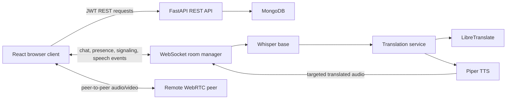

# Translation Bot

> Production Docker and CI/CD guide for `giftme.watch`,
> `api.giftme.watch`, and `admin.giftme.watch`:
> [`docs/PRODUCTION_DEPLOYMENT.md`](docs/PRODUCTION_DEPLOYMENT.md).

Translation Bot is a real-time multilingual meeting platform built with React,
FastAPI, WebSockets, WebRTC, faster-whisper, LibreTranslate, Piper, and MongoDB.

It combines video meetings, translated chat, live speech transcription,
machine translation, and synthesized translated speech in one authenticated
room experience.

> **Project status:** the two-user topology has a production Docker deployment,
> TLS, TURN relay, hardened secrets, health checks, and CI/CD. Larger
> multi-participant video still requires an SFU and deeper observability.

## Product Goal

The project explores a Google Meet-style workflow where each participant can
communicate in a preferred language:

```text
Speaker microphone
  -> browser voice activity detection
  -> WebSocket audio segment
  -> Whisper transcription
  -> source-language detection
  -> translation per unique target language
  -> Piper speech synthesis
  -> targeted WebSocket delivery
  -> queued browser playback
```

Participants can choose whether they want original audio, translated audio,
translated captions, or a combined experience.

## Highlights

### Meetings

- Authenticated room-based meetings
- WebRTC audio and video
- Local and remote video tiles
- Microphone and camera controls
- Google STUN-based ICE discovery
- Explicit meeting join and leave state
- Shareable room links
- Reconnection and participant rejoin handling
- WebRTC diagnostics for ICE, peer, stream, and WebSocket state

### Translation

- Continuous microphone capture while a meeting is active
- Browser-side silence detection for sentence segmentation
- Whisper base speech-to-text
- Source-language detection
- LibreTranslate integration
- Same-language translation skipping
- Translation caching
- One translation and one TTS result per unique target language
- Piper translated speech generation
- Automatic non-overlapping translated-audio queue
- STT, translation, TTS, and end-to-end latency metrics
- Listener modes for original audio, translated audio, and captions

### Collaboration

- Multilingual room chat
- Host broadcast messages
- Direct host-to-participant messages
- Participant-to-host messages
- Per-recipient translated chat
- Participant presence and language distribution
- Per-client outbound WebSocket queues
- Slow-client delivery isolation and timeout handling

### Identity and Administration

- MongoDB user persistence
- JWT authentication
- bcrypt password hashing
- Host, participant, and admin roles
- Preferred language, pronouns, and voice preference
- Editable user profile
- Unique email and username indexes
- Admin user and room statistics endpoints
- Separate admin frontend and admin API
- Admin-only JWT authorization with live MongoDB role checks
- User management, persisted meeting operations, audit logs, and system health

## Admin Portal

Administration is isolated from the meeting application in `admin-frontend/`
and `admin-backend/`. This separation prevents dashboard changes from touching
WebRTC, WebSocket, translation, chat, or public authentication runtime code.

Run the existing backend first because it remains the password-verification
authority, then start the admin API and portal:

```powershell
# Terminal 1: public backend
cd backend
.\.venv\Scripts\Activate.ps1
uvicorn app.main:app --reload --host 0.0.0.0 --port 8000

# Terminal 2: admin backend
cd admin-backend
python -m venv .venv
.\.venv\Scripts\Activate.ps1
pip install -r requirements.txt
uvicorn app.main:app --reload --host 0.0.0.0 --port 8010

# Terminal 3: admin frontend
cd admin-frontend
npm install
npm run dev
```

Open `http://localhost:5176/admin/login`. A current MongoDB user with
`role: "admin"` is required. See
[`docs/ADMIN_ARCHITECTURE.md`](docs/ADMIN_ARCHITECTURE.md) for the security,
data, and deployment boundaries.

## Screenshots

Add current application screenshots before publishing the repository:

```text
docs/screenshots/landing.png
docs/screenshots/login.png
docs/screenshots/meeting.png
docs/screenshots/translation-pipeline.png
docs/screenshots/diagnostics.png
docs/screenshots/voice-test.png
```

## Technology Stack

| Area | Technology |
| --- | --- |
| Frontend | React 19, Vite 6, Tailwind CSS, React Router, Axios |
| Backend | FastAPI, Uvicorn, Pydantic |
| Realtime transport | Native WebSockets with bounded per-client queues |
| Media | WebRTC and `RTCPeerConnection` |
| ICE | Google STUN |
| Database | MongoDB 7 with Motor/PyMongo |
| Authentication | JWT, bcrypt, FastAPI dependencies |
| Speech-to-text | Whisper base |
| Translation | LibreTranslate with caching and fallback handling |
| Text-to-speech | Piper executable and ONNX voice models |
| Local infrastructure | Docker Compose and self-signed HTTPS |

## Architecture



### WebRTC signaling

The existing room WebSocket transports:

- `call_started`
- `call_ended`
- `webrtc_offer`
- `webrtc_answer`
- `webrtc_ice_candidate`

Media does not pass through FastAPI. After signaling and ICE negotiation,
audio/video flows directly between browser peers.

### WebSocket transport

Each connection receives a generated `session_id`. The room manager owns:

- room membership
- meeting membership
- participant presence
- direct and broadcast authorization
- bounded outbound queues
- delivery timeouts
- disconnect cleanup
- WebRTC signaling relay
- speech-translation routing

### Translation routing

Translation is generated once for each unique target language, not once for
every listener. Receivers whose language matches the detected source language
do not receive translated TTS.

## Repository Structure

```text
translation_bot/
|-- backend/
|   |-- app/
|   |   |-- auth/                  # JWT, password, and auth routes
|   |   |-- models/                # MongoDB document models
|   |   |-- realtime_translation/ # Translation-audio orchestration
|   |   |-- repositories/          # MongoDB repository layer
|   |   |-- stt/                   # Whisper base provider
|   |   |-- translation/           # Detection, caching, LibreTranslate
|   |   |-- tts/                   # Piper and voice routing
|   |   |-- main.py                # FastAPI application
|   |   |-- routes.py              # HTTP and WebSocket routes
|   |   `-- websocket_manager.py   # Rooms, queues, signaling, delivery
|   |-- models/piper/              # Piper ONNX voices
|   |-- piper/                     # Windows Piper runtime
|   |-- scripts/                   # Voice model utilities
|   `-- tests/
|-- frontend/
|   |-- src/
|   |   |-- components/            # Video, translation, diagnostics
|   |   |-- components/ui/         # Shared design-system primitives
|   |   |-- contexts/              # Authentication context
|   |   |-- pages/                 # Product pages
|   |   `-- services/              # REST API client
|   `-- .env.example
|-- docs/                           # Architecture and operations docs
|-- scripts/                        # Local HTTPS scripts
`-- docker-compose.yml
```

## Prerequisites

- Windows 10 or 11
- Python 3.11
- Node.js 20 or later
- Docker Desktop
- Git for Windows or OpenSSL
- A browser with WebRTC and `MediaRecorder` support
- Camera and microphone access

Docker Desktop must be running before starting MongoDB or LibreTranslate.

## First-Time Installation

Clone and enter the repository:

```powershell
git clone <your-repository-url>
cd translation_bot
```

Start infrastructure:

```powershell
docker compose up -d mongodb libretranslate
docker compose ps
```

Create the Python environment:

```powershell
cd backend
py -3.11 -m venv .venv
Set-ExecutionPolicy -Scope Process -ExecutionPolicy RemoteSigned
.\.venv\Scripts\Activate.ps1
python -m pip install --upgrade pip
python -m pip install -r requirements.txt
Copy-Item .env.example .env
cd ..
```

Install frontend dependencies:

```powershell
cd frontend
npm install
cd ..
```

Whisper base downloads the configured model on first use. The repository
currently defaults to the `base` model.

Download the required Piper voice models:

```powershell
cd backend
.\.venv\Scripts\python.exe scripts\download_piper_voices.py en hi es fr de
cd ..
```

Piper voice models and platform-specific Piper executables are intentionally
excluded from Git because they are large generated artifacts. Install the
appropriate Piper runtime for the deployment platform and configure
`PIPER_EXECUTABLE`. On Windows, the local HTTPS helper expects the executable
at `backend/piper/piper/piper.exe`.

## Run Locally over HTTP

HTTP is suitable for normal localhost development. Cross-device camera and
microphone access requires HTTPS.

### Terminal 1: infrastructure

```powershell
cd translation_bot
docker compose up -d mongodb libretranslate
```

### Terminal 2: backend

```powershell
cd translation_bot\backend
Set-ExecutionPolicy -Scope Process -ExecutionPolicy RemoteSigned
.\.venv\Scripts\Activate.ps1
uvicorn app.main:app --reload --host 0.0.0.0 --port 8000
```

### Terminal 3: frontend

```powershell
cd translation_bot\frontend
npm run dev -- --host 0.0.0.0
```

Open:

- Frontend: `http://localhost:5173`
- Backend health: `http://localhost:8000`
- API documentation: `http://localhost:8000/docs`
- LibreTranslate: `http://localhost:5000/languages`

## Run with HTTPS

HTTPS is required for reliable camera/microphone access from phones or other
computers on the LAN.

### 1. Find the host LAN address

```powershell
ipconfig
```

Locate the Wi-Fi `IPv4 Address`, for example `192.168.1.100`.

### 2. Generate the certificate

From the repository root:

```powershell
.\scripts\generate-local-certs.ps1 -LanIp 192.168.1.100
```

### 3. Configure generated meeting links

```powershell
Set-Content .\frontend\.env.local 'VITE_PUBLIC_APP_URL=https://192.168.1.100:5173'
```

### 4. Start the HTTPS backend

```powershell
.\scripts\run-backend-https.ps1 -WhisperModel base
```

Use `-WhisperModel small` for better accuracy with higher CPU and latency cost.

### 5. Start the HTTPS frontend

In another terminal:

```powershell
.\scripts\run-frontend-https.ps1
```

### 6. Trust the development certificate

On every testing device, open the backend first:

```text
https://192.168.1.100:8000
```

Accept the self-signed certificate warning. Then open:

```text
https://192.168.1.100:5173
```

Allow camera and microphone permissions.

If another device cannot reach the host, open PowerShell as Administrator and
allow the two development ports:

```powershell
.\scripts\configure-lan-firewall.ps1
```

## LibreTranslate Language Models

Check installed languages:

```powershell
Invoke-RestMethod http://localhost:5000/languages
```

Install or update the requested local language packages:

```powershell
docker compose exec libretranslate ./venv/bin/python scripts/install_models.py --load_only_lang_codes en,hi,es,fr,de,it,pt,ru,ar,nl --update
docker compose restart libretranslate
docker compose logs -f libretranslate
```

Model installation can take several minutes. Wait for the log line showing
Gunicorn listening on port `5000`.

## Environment Variables

### Backend: `backend/.env`

```env
MONGODB_URL=mongodb://localhost:27017
MONGODB_DB=translation_bot
MONGODB_SERVER_SELECTION_TIMEOUT_MS=5000

JWT_SECRET=replace-with-a-long-random-production-secret
JWT_ALGORITHM=HS256
ACCESS_TOKEN_EXPIRE_MINUTES=60

LIBRETRANSLATE_URL=http://127.0.0.1:5000
TRANSLATION_TIMEOUT_SECONDS=8.0
TRANSLATION_CACHE_MAX_SIZE=512
MIN_DETECTION_CONFIDENCE=0.72

WHISPER_MODEL=base
WHISPER_DEVICE=cpu
WHISPER_COMPUTE_TYPE=int8
HF_HUB_DISABLE_XET=1

PIPER_EXECUTABLE=C:\path\to\piper.exe
```

The HTTPS helper points `PIPER_EXECUTABLE` to the local Windows runtime path
`backend/piper/piper/piper.exe`. That runtime must be installed separately
after cloning.

### Frontend: `frontend/.env.local`

```env
VITE_PUBLIC_APP_URL=https://192.168.1.100:5173
# VITE_API_BASE_URL=https://192.168.1.100:8000
```

If `VITE_API_BASE_URL` is omitted, the frontend uses its current hostname with
port `8000`.

## How to Test

### Two-browser meeting

1. Create one host and one participant account.
2. Open the app in two different browser profiles.
3. Join the same room.
4. Let the host start the video meeting.
5. Let the participant explicitly select **Join Video Call**.
6. Confirm local and remote video on both sides.
7. Select different preferred languages.
8. Speak a complete sentence and pause briefly.
9. Verify captions, translation, latency metrics, and translated playback.

### Different-device meeting

1. Connect both devices to the same Wi-Fi network.
2. Use the HTTPS LAN URL on both devices.
3. Trust the backend certificate on both devices.
4. Allow camera and microphone access.
5. Use a generated meeting link to join the same room.

## Verification Commands

Run backend tests:

```powershell
cd backend
.\.venv\Scripts\python.exe -m unittest discover -s tests -v
```

Compile backend modules:

```powershell
cd backend
.\.venv\Scripts\python.exe -m compileall app
```

Build the frontend:

```powershell
cd frontend
npm run build
```

## Troubleshooting

### MongoDB connection refused

```powershell
docker compose up -d mongodb
docker compose ps
```

### Docker named-container conflict

```powershell
docker compose down
docker compose up -d
```

Avoid manually creating containers with the same Compose names.

### `ERR_SSL_PROTOCOL_ERROR`

An older HTTP Uvicorn process is usually still using port `8000`.

```powershell
netstat -ano | findstr :8000
```

Stop the old Uvicorn terminal, then run the HTTPS backend script again.

### Frontend cannot reach FastAPI over HTTPS

Open the backend URL directly and accept the certificate warning before
refreshing the frontend.

### Camera or microphone blocked

- Use `localhost` or HTTPS.
- Check browser site permissions.
- Close other applications using the camera.
- Confirm Windows privacy settings allow browser access.

### WebRTC connects locally but not across networks

Google STUN is configured, but no TURN server is currently included. Some NAT
and firewall combinations therefore cannot establish a direct peer connection.

### LibreTranslate returns `400`

Check `/languages`. The selected source or target language may not be installed
in the running LibreTranslate container.

### Whisper is slow on first use

The model may be downloading or warming up. `base` is the default compromise.
Use `tiny` for speed or `small` for accuracy.

## Current Limitations

- Two-user video is the fully supported topology.
- No TURN server is configured.
- No SFU is configured for scalable multiparty media.
- LibreTranslate quality varies by language pair.
- Piper voice quality and gender variety vary by language.
- Whisper and Piper are CPU-heavy in the default local configuration.
- Audio is currently transported as Base64 WebSocket payloads.
- Self-signed HTTPS is intended only for local development.
- Admin analytics UI is still limited.

## Roadmap

- Add TURN for reliable cross-network calls
- Migrate multiparty meetings to an SFU
- Add separate spoken-language and listening-language preferences
- Upgrade translation quality for Indian and low-resource languages
- Run STT and TTS in managed worker processes
- Send binary audio frames instead of Base64
- Add meeting recording and transcript export
- Expand admin moderation and analytics
- Add automated browser-based WebRTC tests
- Add production deployment and observability

## Additional Documentation

- [Architecture](docs/ARCHITECTURE.md)
- [WebRTC flow](docs/WEBRTC_FLOW.md)
- [Translation pipeline](docs/TRANSLATION_PIPELINE.md)
- [Deployment](docs/DEPLOYMENT.md)
- [Troubleshooting](docs/TROUBLESHOOTING.md)
- [Feature status](docs/FEATURES.md)
- [Cross-device video testing](docs/CROSS_DEVICE_VIDEO_TESTING.md)

## Security Notes

- Replace the development JWT secret before deployment.
- Do not commit `.env`, `.env.local`, certificates, or private keys.
- Restrict production CORS origins.
- Use trusted TLS certificates in production.
- Add token revocation or refresh-token rotation for long-lived sessions.
- Apply rate limiting to authentication, translation, and WebSocket endpoints.

## Acknowledgements

This project uses Whisper base, LibreTranslate, Piper, WebRTC, FastAPI,
React, and MongoDB.
