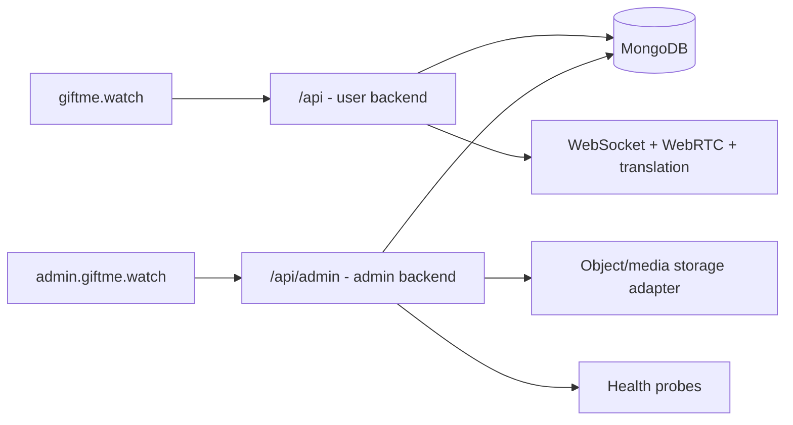

# Production Administration Architecture

## Application boundary

The repository contains independent public and administrative applications:

```text
frontend/        Public meeting UI
backend/         Public REST, WebSocket, WebRTC signaling, translation
admin-frontend/  Administration UI
admin-backend/   Administration, CMS, media, policy, observability API
shared/          Future versioned contracts only
```

The admin applications do not import public frontend components, the
WebSocket manager, WebRTC signaling, STT, translation, or TTS runtime code.
They can be built, deployed, scaled, and rolled back separately.



MongoDB is shared because administrators manage the same users and persisted
meeting records. Authentication keys, cookies, middleware, dependencies,
routes, and frontend storage are not shared.

## Authentication boundary

### User domain

- Login: `POST /api/auth/login`
- Signing key: `JWT_SECRET`
- Claims: `type=user`, `token_use=access`
- Consumer: public user dependencies and WebSocket authentication
- Existing `/auth/*` routes remain available for local compatibility

### Admin domain

- Login: `POST /api/admin/auth/login`
- Registration: `POST /api/admin/auth/register`
- Signing key: `ADMIN_JWT_SECRET`
- Access lifetime: 15 minutes by default
- Refresh lifetime: 7 days by default
- Claims: `type=admin`, `token_use=access|refresh`, `sid`, `jti`, `iss`, `aud`
- Storage: host-only, HttpOnly, SameSite cookies
- Rotation: every refresh replaces the stored refresh fingerprint
- Revocation: logout and account authorization failures revoke the MongoDB
  `admin_sessions` record

The admin backend verifies the password hash directly and never delegates to
the user login endpoint. User-token decoding requires `type=user`; admin-token
decoding uses a different key and requires `type=admin`. A token from either
domain cannot authorize the other API.

Admin registration is intentionally not public signup. The first account
requires `ADMIN_BOOTSTRAP_CODE`; an atomic MongoDB bootstrap claim prevents two
initial administrators from racing. After the first admin exists, registration
requires a hashed, expiring, single-use invitation generated by an
administrator with `roles.write`.

Unsafe admin requests also pass an origin allow-list middleware. Production
cookies must use `Secure=true` and the admin API must only be served over TLS.

## Authorization

`require_admin` validates the admin cookie, token domain, current MongoDB user,
role, and account status. `require_permission` adds capability-level guards.

Included roles:

- Administrator
- Support
- Content editor

Permissions are explicit strings such as `users.write`, `content.write`, and
`system.read`. Existing administrators without migrated permissions receive
the full administrator set so the deployment does not lock them out.

## Repository design

- `AdminSessionRepository`: refresh rotation and revocation
- `AdminUserRepository`: user search and account operations
- `AdminMeetingRepository`: room records and moderation commands
- `PlatformRepository`: CMS, flags, languages, voices, settings, roles,
  announcements, and feedback
- `MediaRepository`: asset metadata and storage paths
- `AuditRepository`: administrative activity trail

Routers own validation and HTTP behavior. Repositories own MongoDB access.
This allows storage adapters or service layers to change without rewriting the
React portal.

## Modules

The portal implements:

- Dashboard
- Users
- Meetings
- Analytics
- Content management
- Media library
- Feature flags
- Languages
- Voice models
- Translation settings
- Feedback
- Announcements
- Roles and permissions
- Audit logs
- System health
- Platform settings

CMS content is versioned and supports draft, published, and archived states.
Published content is available from `GET /api/public/content`. The existing
public React app remains unchanged; connecting it to this delivery endpoint is
a separate public-application release.

Media supports upload, replace, delete, JPEG/PNG/WebP crop, and compression.
Local storage is used for development. Production should replace it with an
S3-compatible adapter, malware scanning, and signed URLs for non-public files.

## Meeting controls

The admin backend cannot safely call an in-memory WebSocket manager in another
process. Moderation creates durable `admin_commands`. Production live
enforcement requires the public backend to consume those commands through
Redis Streams, NATS, or MongoDB change streams.

## Production routing

```text
giftme.watch/*              -> public frontend
giftme.watch/api/*          -> public backend
giftme.watch/ws/*           -> public backend WebSocket
admin.giftme.watch/*        -> admin frontend
admin.giftme.watch/api/admin/* -> admin backend
admin.giftme.watch/admin-media/* -> media CDN/storage
```

Keep the admin cookie host-only. Do not set a parent `.giftme.watch` cookie
domain; that would unnecessarily expose admin cookies to the public host.

## Migration

1. Generate independent high-entropy `JWT_SECRET` and `ADMIN_JWT_SECRET`
   values.
2. Existing user access tokens do not contain `type=user`; users must sign in
   again after deployment.
3. Existing admins keep their `role=admin`. Permission fields can be assigned
   from the Users and Roles screens.
4. Create indexes during admin API startup.
5. Set `ADMIN_COOKIE_SECURE=true` in production.
6. Route `/api/admin/*` only to the admin backend.
7. Remove `ADMIN_BOOTSTRAP_CODE` from the production secret store after the
   first administrator is registered.
