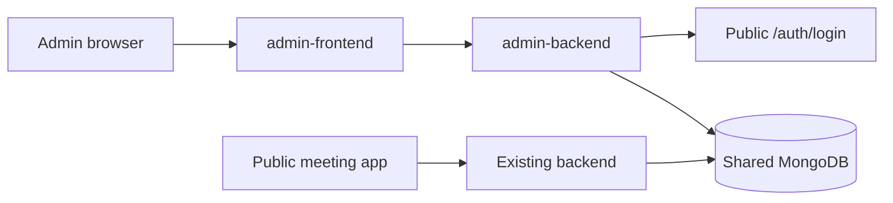

# Admin Application Architecture

## Design decision

Administration is implemented as two separate applications:

- `admin-frontend`: React/Vite operator interface served under `/admin`.
- `admin-backend`: FastAPI REST service for administration and observability.

They share MongoDB data and JWT configuration with the public platform, but
neither imports the meeting WebSocket manager, WebRTC signaling code,
translation pipeline, or chat components. This keeps administrative releases
from changing the latency-sensitive meeting runtime.



## Authentication and authorization

1. The admin portal sends credentials to `POST /admin/auth/login`.
2. The admin API delegates password verification to the existing public
   `POST /auth/login` route.
3. The returned JWT is validated using the shared secret and algorithm.
4. Every protected admin request fetches the current user from MongoDB.
5. A missing admin role returns HTTP 403. Disabled and deleted accounts also
   return HTTP 403.

Checking MongoDB on every admin request means a role change or account disable
takes effect without waiting for a JWT to expire.

## Repository boundaries

- `AdminUserRepository` owns user querying and mutation.
- `AdminMeetingRepository` owns persisted room queries and moderation command
  creation.
- `AuditRepository` owns immutable administrative event records.

Routers validate HTTP input and serialize output; they do not contain MongoDB
query construction.

## Live meeting control

The admin service is deliberately a separate process, so it cannot call the
in-memory WebSocket manager directly. End-meeting and kick-participant actions
are persisted to `admin_commands` and marked as queued. End meeting also marks
the persisted room inactive.

Production live enforcement requires a shared control plane such as Redis
Streams, NATS, or MongoDB change streams. The meeting backend will consume each
command and apply it to its local connection manager. This is the next
architecture step; pretending an in-memory cross-process call exists would
make the dashboard misleading.

## Implemented modules

- Dashboard operational counts and recent activity
- User search, filtering, pagination, update, disable, soft delete, promotion,
  and password-reset requirement
- Persisted meeting search, filtering, export, logs, and queued moderation
- Read-only language catalog
- Audit logs
- System health
- Responsive light and dark themes

Content, media, voice uploads, announcements, settings, and analytics
persistence remain explicit placeholders as required.

## Deployment

Use a reverse proxy with separate upstreams:

```text
/admin/*       -> admin-frontend static build
/admin-api/*   -> admin-backend:8010
/*             -> public frontend
/api/*, /ws/*  -> existing backend:8000
```

Use separate environment files and secrets in production. The admin API must
not be publicly reachable without TLS, rate limiting, and an allow-listed
origin.
