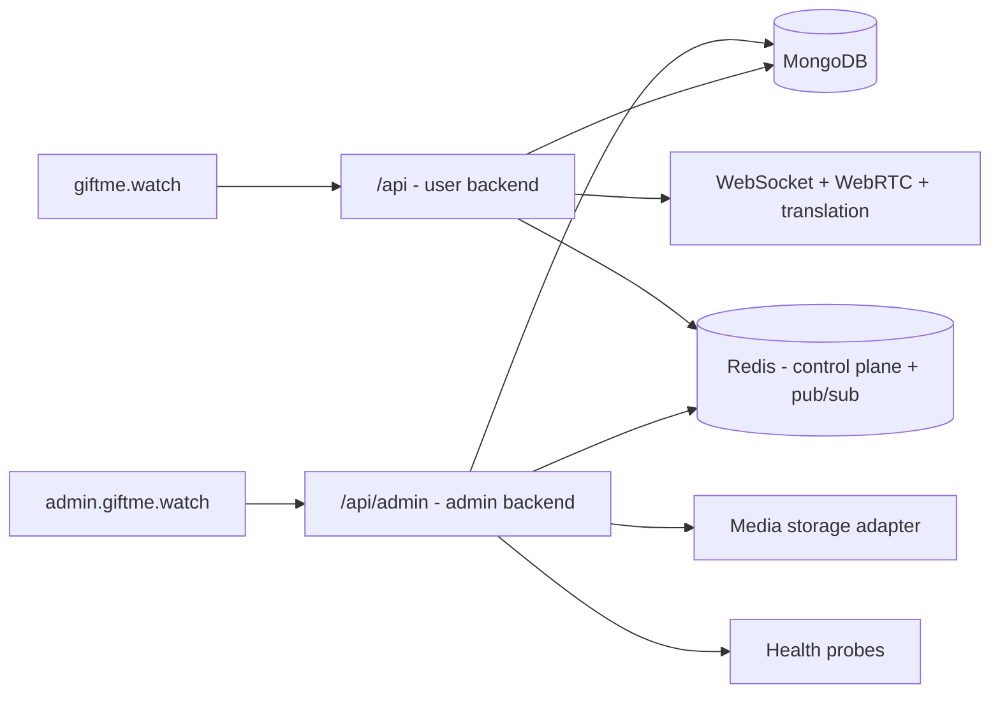
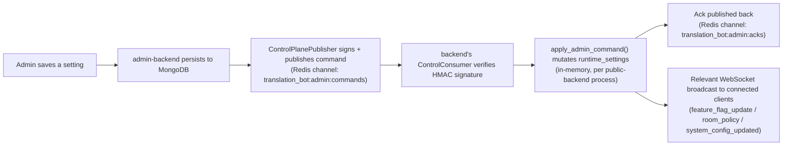

# VOXO Admin Console — Production Architecture

**Objective:** the admin console becomes the single source of truth for every configurable aspect of VOXO — content, branding, meeting behavior, translation/voice pipeline tuning, users, roles, and system operation — so that no configuration change requires editing React code, CSS, JSON, or environment files.

This document describes the target production architecture: application boundaries, the authentication/authorization model (mostly already built and still accurate), the module list (summarized here, detailed in [ADMIN_MODULES.md](ADMIN_MODULES.md)), and the live-configuration propagation strategy (Task 4). It supersedes the previous version of this file, which is folded in below with one correction noted explicitly in the "Live command delivery" section.

Companion documents: [ADMIN_MODULES.md](ADMIN_MODULES.md) · [ADMIN_DATA_MODEL.md](ADMIN_DATA_MODEL.md) · [ADMIN_ENTITY_MAPPING.md](ADMIN_ENTITY_MAPPING.md) · [ADMIN_GAP_ANALYSIS.md](ADMIN_GAP_ANALYSIS.md) · [ADMIN_IMPLEMENTATION_PLAN.md](ADMIN_IMPLEMENTATION_PLAN.md)

---

## 1. Application boundary

```text
frontend/        Public meeting UI + marketing site
backend/         Public REST, WebSocket, WebRTC signaling, translation/STT/TTS
admin-frontend/  Administration UI
admin-backend/   Administration, CMS, media, policy, observability API
shared/          Future versioned contracts only
```

The admin applications do not import public frontend components, the WebSocket manager, WebRTC signaling, STT, translation, or TTS runtime code. They can be built, deployed, scaled, and rolled back independently.


```mermaid
flowchart LR
    User["giftme.watch"] --> UserAPI["/api - user backend"]
    Admin["admin.giftme.watch"] --> AdminAPI["/api/admin - admin backend"]
    UserAPI --> MongoDB[("MongoDB")]
    AdminAPI --> MongoDB
    AdminAPI --> Media["Media storage adapter"]
    AdminAPI --> Redis[("Redis - control plane + pub/sub")]
    UserAPI --> Redis
    AdminAPI --> Services["Health probes"]
    UserAPI --> Meeting["WebSocket + WebRTC + translation"]
```

MongoDB is shared because administrators manage the same users and persisted meeting records. Redis is shared as the control-plane transport (see §4). Authentication keys, cookies, middleware, dependencies, routes, and frontend storage are not shared.

## 2. Authentication boundary

### User domain
- Login: `POST /auth/login` · signing key `JWT_SECRET` · claims `type=user` · consumed by public user dependencies and WebSocket auth.

### Admin domain
- Login: `POST /api/admin/auth/login` · Registration: `POST /api/admin/auth/register`
- Signing key: `ADMIN_JWT_SECRET` (deliberately separate from `JWT_SECRET`)
- Access lifetime 15 min / refresh lifetime 7 days by default; claims include `type=admin`, `token_use`, `sid`, `jti`, `iss`, `aud`
- Storage: host-only, HttpOnly, SameSite cookies; rotation on every refresh; revocation via the `admin_sessions` MongoDB record
- First-admin bootstrap requires `ADMIN_BOOTSTRAP_CODE` with an atomic MongoDB claim to prevent a race; all subsequent registrations require a hashed, expiring, single-use invitation issued by an admin with `roles.write`

A token from either domain cannot authorize the other API — different signing keys, different `type` claim requirements. Unsafe admin requests also pass an origin allow-list middleware; production cookies must use `Secure=true` and TLS-only.

## 3. Authorization

`require_admin` validates the admin cookie, token domain, current MongoDB user, role, and account status. `require_permission` adds capability-level guards using explicit permission strings (e.g. `users.write`, `content.write`, `system.read`) resolved from the admin's role via the `admin_roles` collection.

**Gap identified in this audit** (see [ADMIN_GAP_ANALYSIS.md](ADMIN_GAP_ANALYSIS.md) Part D.4): this authorization model is fully enforced server-side, but **no admin-frontend page currently reads the logged-in admin's own `permissions` array** to hide/disable controls it can't use. Every module's implementation must close this — not as a security fix (the backend already rejects unauthorized calls) but as a UX correctness fix (an admin shouldn't see a working-looking button that always 403s).

## 4. Live configuration propagation (Task 4)

Two mechanisms currently coexist, with different reliability guarantees. Every new admin-editable setting must use the first one; the second is being phased out (see [ADMIN_IMPLEMENTATION_PLAN.md](ADMIN_IMPLEMENTATION_PLAN.md)).

### 4.1 Redis pub/sub control plane (the correct, target mechanism)


```mermaid
flowchart LR
    A["Admin saves a setting"] --> B["admin-backend persists to MongoDB"]
    B --> C["ControlPlanePublisher signs + publishes command\n(Redis channel: translation_bot:admin:commands)"]
    C --> D["backend's ControlConsumer verifies HMAC signature"]
    D --> E["apply_admin_command() mutates runtime_settings\n(in-memory, per public-backend process)"]
    E --> F["Ack published back\n(Redis channel: translation_bot:admin:acks)"]
    E --> G["Relevant WebSocket broadcast to connected clients\n(feature_flag_update / room_policy / system_config_updated)"]
```

This is signed (`CONTROL_PLANE_SECRET`, shared between both backends), acknowledged (the admin backend's `publish_and_wait` times out after `CONTROL_PLANE_ACK_TIMEOUT_SECONDS` if no ack arrives), and already implements exactly the "live enforcement" the previous version of this document described as future work. **Correction to the previous architecture doc**: that document's "Meeting controls" section stated *"Production live enforcement requires the public backend to consume those commands through Redis Streams, NATS, or MongoDB change streams"* as unimplemented future work — this is out of date. The Redis pub/sub control plane already does this today for feature flags, language toggles, translation/voice settings, and meeting/user moderation commands.

### 4.2 Direct HTTP webhook (legacy, being phased out)

Branding, page-builder, and general-settings changes currently bypass the control plane entirely: `admin-backend` POSTs directly to a **hardcoded** `http://127.0.0.1:8000/api/internal/reload-config`, unauthenticated, fire-and-forget. This must be migrated onto the control-plane pattern above (a new `UPDATE_BRANDING`/`UPDATE_CONTENT` command type) both for consistency and because the current endpoint has no authentication check at all — anyone who can reach the public backend's internal port can force a config reload.

### 4.3 Propagation classes

For every new admin-editable entity, classify it into exactly one of these four categories — this classification is the deliverable of Task 4, and belongs in each entity's row in [ADMIN_ENTITY_MAPPING.md](ADMIN_ENTITY_MAPPING.md):

| Class | Mechanism | Examples | Latency |
|---|---|---|---|
| **Instant (live broadcast)** | Control-plane command → WebSocket broadcast to already-connected clients | Feature flags, room policy (chat/translation enable), meeting moderation commands, active-meeting host-permission changes | Sub-second |
| **Cache invalidation** | Control-plane command triggers `runtime_settings.load_from_db()` (full or partial reload) on the public backend; already-connected clients unaffected until their next relevant action or the next broadcast | Translation settings, voice routing, languages, translation modes, meeting policy defaults (affects *next* room created, not active ones) | Seconds, on next read |
| **Page refresh required** | Public frontend fetches once on mount (`ConfigContext`) and has no live-update path today | Branding CSS tokens, page-builder sections, content pages, blog posts, pricing/FAQ/testimonial content | Until next page load — **unless** upgraded to also emit a `voxo_system_config` event, which `ConfigContext.jsx` already listens for; most content changes should be upgraded to this class rather than left at "refresh required" |
| **Restart required** | Environment-variable-only settings with no DB-backed override at all | `PIPER_EXECUTABLE`, `MONGODB_URL`, JWT secrets, CORS origin lists, Redis URL | Full backend redeploy |

**Design goal of this project**: shrink the "Restart required" column to the smallest possible set (fundamentally-infrastructural values: connection strings, secrets, listen ports) and push everything else — including the new Security-module settings — into "Cache invalidation" or "Instant," never leaving a genuinely user-facing setting stuck requiring a restart.

### 4.4 Draft preview (Phase 2 addition)

Separate from the four propagation classes above (which all concern *published* content), the generic CMS editor needs a way to show an admin their *unpublished* draft with pixel-accurate styling before they commit to publishing. This uses a third signed secret, `CMS_PREVIEW_SECRET` (shared between admin-backend and the public backend, same pattern as `CONTROL_PLANE_SECRET`, but deliberately a separate secret scoped only to this purpose): admin-backend mints a short-lived (5 minute default), page-scoped JWT (`POST /api/admin/cms/pages/{page}/preview-token`); the admin frontend embeds `{public frontend origin}/preview/{page}?token=...` in an `<iframe>`; the public backend verifies the token and serves that one page's draft sections (`GET /api/public/cms/pages/{page}/preview`), rendered by the same real page component the public site uses. No admin session cookie crosses origins — the token itself is the only credential, and it authorizes nothing but a single page's draft read for a few minutes.

**Known production gap, not yet fixed:** the Caddyfile's `security_headers` snippet sets `X-Frame-Options: SAMEORIGIN` on `giftme.watch`, which will block `admin.giftme.watch` from framing `giftme.watch/preview/*` in production (same-origin dev has no such header, so this doesn't surface locally). Needs a scoped fix — e.g. a `Content-Security-Policy: frame-ancestors https://admin.giftme.watch` override on just the `/preview/*` route — before this is relied on in production.

## 5. Repository design (unchanged, still accurate)

- `AdminSessionRepository` — refresh rotation and revocation
- `AdminUserRepository` — user search and account operations
- `AdminMeetingRepository` — room records and moderation commands
- `PlatformRepository` — generic collection CRUD, parameterized by collection name; backs CMS content, flags, languages, voices, settings, roles, announcements, feedback, translation modes
- `MediaRepository` — asset metadata and storage paths
- `AuditRepository` — administrative activity trail

Routers own validation and HTTP behavior; repositories own MongoDB access. New modules (Meeting Experience, AI Models, Security, Developer Tools — see [ADMIN_MODULES.md](ADMIN_MODULES.md)) should reuse `PlatformRepository`'s generic keyed-document pattern wherever the data is a flat settings blob, and only introduce a new repository class where the entity has genuinely distinct query patterns (as `AdminMeetingRepository` does for rooms). This directly follows the "identify reusable models instead of creating duplicate structures" instruction — most new settings surfaces are just another `platform_settings`-style keyed document, not a new collection.

## 6. Module list (summary)

See [ADMIN_MODULES.md](ADMIN_MODULES.md) for full detail on each. Top-level navigation:

Dashboard · Content · Branding · Media Library · Users · Organizations · Meetings · Meeting Experience · Languages · Voice Models · Translation · AI Models · System · Security · Developer Tools · Feature Flags · Roles & Permissions · Audit Logs · Analytics

## 7. Production routing (unchanged)

```text
giftme.watch/*                    -> public frontend
giftme.watch/api/*                -> public backend
giftme.watch/ws/*                 -> public backend WebSocket
admin.giftme.watch/*              -> admin frontend
admin.giftme.watch/api/admin/*    -> admin backend
admin.giftme.watch/admin-media/*  -> media CDN/storage
```

Keep the admin cookie host-only. Do not set a parent `.giftme.watch` cookie domain.

## 8. Media & CMS versioning (unchanged, extended)

CMS content is versioned and supports draft, published, and archived states. Published content is available from `GET /api/public/content`. This versioning model extends to every new content type added to the Content module (blog posts, FAQs, testimonials, pricing) — one consistent draft/publish lifecycle, not a bespoke one per content type.

**Phase 1 addition — generic page/section CMS engine.** Alongside the flat `admin_content` model above, a second, page-agnostic engine now exists specifically for ordered, section-based pages (Landing, Features, Pricing, Blogs, etc.): the `cms_pages` collection (one document per page key, holding `draft` and `published` section lists side by side plus a `version` counter) and `cms_page_versions` (an immutable snapshot per publish). It is driven by a static section-type schema registry (`admin-backend/app/cms/section_types.py`) so the admin editor is fully dynamic — no section type or page gets its own hand-written form. Routes: `/api/admin/cms/*` (admin CRUD/publish/revert) and `/api/public/cms/pages/{page}` (published-only, mirrored directly in the public backend the same way `/api/public/content` is). See [ADMIN_DATA_MODEL.md](ADMIN_DATA_MODEL.md) and [ADMIN_IMPLEMENTATION_PLAN.md](ADMIN_IMPLEMENTATION_PLAN.md) Phase 1 for full detail. This engine is additive: it does not replace `landing_sections`/`PageBuilderPage.jsx` yet — that migration is Phase 2.

**Phase 2 extension — rich text, page SEO, scheduling schema, three new section types.** The `richtext` field type (declared but unimplemented in Phase 1) now renders a real WYSIWYG editor (`admin-frontend/src/components/cms/RichTextEditor.jsx`, built on TipTap) supporting headings, formatting, links, lists, blockquotes, code blocks, tables, images (via the existing Asset Library), video embeds, and a custom CTA-button node. Every section type's `body` field now uses `richtext` instead of `textarea`. Authored HTML is sanitized server-side against an explicit allowlist (`admin-backend/app/cms/sanitize.py`, using `nh3`) on every draft save — this is the authoritative security boundary; the public frontend's `SafeHtml` component (DOMPurify) is defense-in-depth only, not a substitute. Three new section types were added to the registry: `statistics` and `trusted_by` (both ship with zero cards by default — no fabricated numbers or partner names, an admin must add real ones before publishing) and `footer_cta` (a schema deliberately distinct from the general-purpose `cta` type, scoped to the banner immediately before the site footer). The `cms_pages` draft/published documents gained two more fields alongside `sections`: `seo` (`meta_title`/`meta_description`/`og_image_url`, editable via a page-level panel in the "Pages" admin module, applied to the public page's `<title>`/meta tags only when explicitly set) and `scheduled_publish_at` (persisted on save, **schema only** — no enforcement job or admin UI exists yet to act on it).

Media supports upload, replace, delete, JPEG/PNG/WebP crop, and compression. Local storage is used for development; production should use an S3-compatible adapter, malware scanning, and signed URLs for non-public files.
