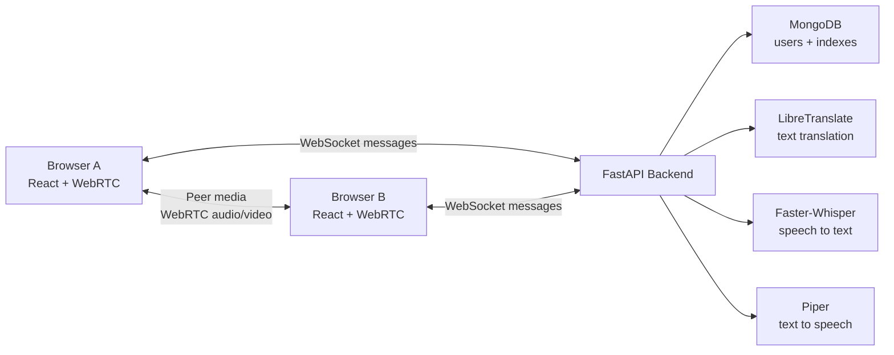
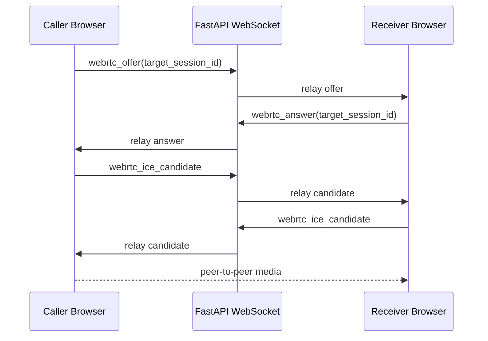
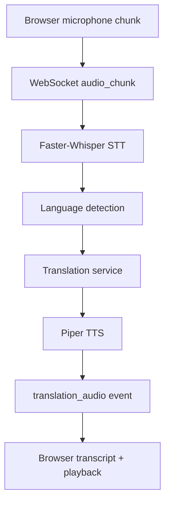
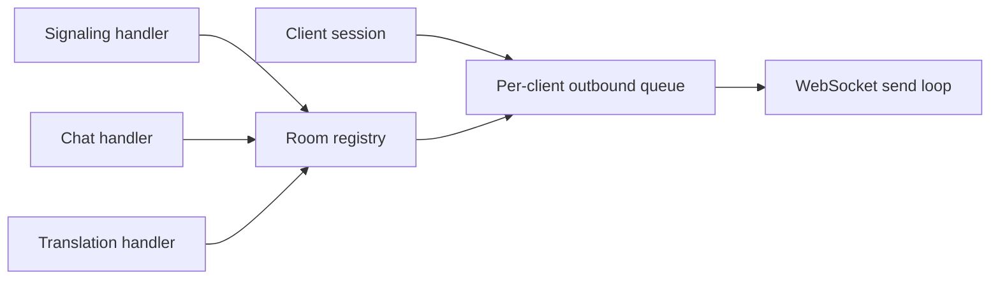

# Architecture

Translation_Bot is split into a React/Vite frontend and a FastAPI backend. The backend owns authentication, room state, WebSocket transport, translation, STT, and TTS orchestration. The browser owns meeting UI, microphone/camera capture, WebRTC peer connections, and translated audio playback.

## High-Level System



## Frontend Architecture

The frontend is organized around authenticated pages and reusable meeting components.

```text
frontend/src/
  App.jsx
  contexts/AuthContext.jsx
  services/api.js
  pages/
    LoginPage.jsx
    SignupPage.jsx
    ChatPage.jsx
    ProfilePage.jsx
    VoiceTestPage.jsx
  components/
    DiagnosticsPanel.jsx
    TranslationPanel.jsx
    TranslatedAudioPlayer.jsx
    VideoCall.jsx
    VideoGrid.jsx
    ui/
      Panel.jsx
      Skeleton.jsx
      StatusBadge.jsx
```

`ChatPage.jsx` is the meeting controller. It coordinates:

- room join and leave
- WebSocket lifecycle
- WebRTC peer creation
- microphone and camera state
- translated transcript state
- TTS playback state
- diagnostics state

Reusable components render focused parts of the experience. This keeps future video, admin, and translation work easier to isolate.

## Backend Architecture

```text
backend/app/
  main.py
  routes.py
  database.py
  schemas.py
  websocket_manager.py
  auth/
  repositories/
  translation/
  realtime_translation/
  stt/
  tts/
```

Backend responsibilities:

- `auth/`: password hashing, JWT creation, user identity
- `repositories/`: MongoDB persistence for users, room logs, translation logs
- `translation/`: language detection, caching, LibreTranslate fallback
- `stt/`: Faster-Whisper model loading and transcription
- `tts/`: Piper executable integration, voice routing, speech profiles
- `realtime_translation/`: audio chunk processing pipeline
- `websocket_manager.py`: rooms, sessions, queues, signaling, delivery, cleanup

## Signaling Flow



## Translation Flow



## Data Flow

Room messages use the same transport layer for chat, signaling, and translation events. Each connected client has a `session_id`, room membership, preferred language, role, and outbound queue. This makes the architecture compatible with future persistence and admin monitoring.



## Future Extension Points

- Replace mesh WebRTC with an SFU for larger meetings.
- Store room events and transcripts in MongoDB.
- Add TURN server credentials to ICE configuration.
- Add admin dashboard views using existing statistics and logging data.
- Add video-specific transcription and translated captions without changing room identity.
