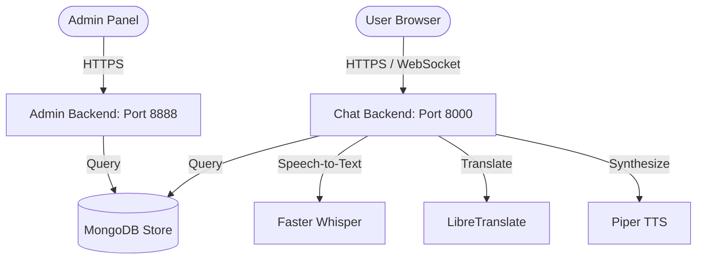

# Architecture Manual

This document details the multi-service offline architecture and pipeline layers of Translation Bot.

## System Topology

## Data Lifecycle

### 1. Audio Processing Pipeline
Spoken Audio (Client microphone) $\rightarrow$ VAD preset threshold filtering $\rightarrow$ STT (Faster-Whisper) extraction $\rightarrow$ Glossary lookup & machine translation (LibreTranslate) $\rightarrow$ TTS Synthesis (Piper) $\rightarrow$ Compressed Audio packets broadcasted to client sessions.

### 2. Meeting Intelligence Pipeline
As conversation segments accumulate, transcripts are parsed asynchronously:
- **Heuristic Engine**: Matches key speech tokens using native NLP pattern classes.
- **Timeline compiler**: Merges message history, recording markers, and whiteboard logs chronologically.
- **Export dispatchers**: Formats raw objects into JSON, HTML, Markdown, or PDF file buffers.
