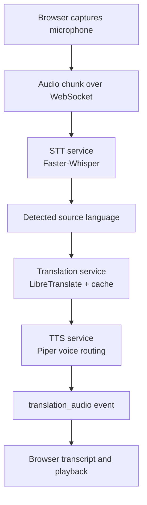

# Translation Pipeline

The current pipeline converts microphone audio into translated text and translated audio. It is designed as a foundation for real-time multilingual meetings.

## Pipeline Overview

## STT Process

1. Browser captures audio from `navigator.mediaDevices.getUserMedia`.
2. Audio chunks are sent through the existing WebSocket transport.
3. The backend writes or decodes the chunk into a format Faster-Whisper can process.
4. Faster-Whisper returns transcript text and language metadata.
5. The transcript is broadcast as a translation status event.

Current model target is local CPU-friendly development. Tiny models respond faster but are less accurate than base or small models.

## Translation Process

The translation service:

- detects source language when needed
- skips same-language translation
- caches repeated messages
- calls LibreTranslate
- falls back gracefully to original text when translation fails
- logs source language, target language, result, cache hit, and failures

This service is the future integration point for custom translation models or fine-tuned domain models.

## TTS Process

Piper synthesis receives:

- translated text
- target language
- listener voice preference
- speech profile

The voice router chooses the best available ONNX voice model. If the requested model is not available, the service falls back to a safe default and reports that fallback in the response.

Speech profiles:

- `standard`: stable default
- `natural`: improved punctuation and pacing
- `expressive`: stronger pauses and conversational pacing

## Audio Playback Process

The backend sends `translation_audio` events with:

- speaker identity
- source language
- target language
- original transcript
- translated transcript
- TTS audio payload or URL
- latency metrics

The frontend displays transcripts and exposes translated audio playback. In the future, this can become automatic listener-side playback based on listener preferences.

## Latency Targets

| Stage | Target |
| --- | --- |
| STT | under 1000 ms |
| Translation | under 500 ms |
| TTS | under 1000 ms |
| Total perceived delay | under 2500 ms |

## Current Constraints

- Browser chunking can cut off incomplete sentences.
- CPU-only STT can be slow on lower-end laptops.
- LibreTranslate quality varies by language pair.
- Piper voices are limited by installed local models.
- Translated audio is generated per target language, not yet fully synchronized with live speech.

## Next Improvements

- Add voice activity detection before sending STT chunks.
- Add sentence-boundary buffering so users can finish a sentence.
- Add per-language model quality selection.
- Add streaming partial transcripts.
- Add listener controls for automatic translated audio playback.
