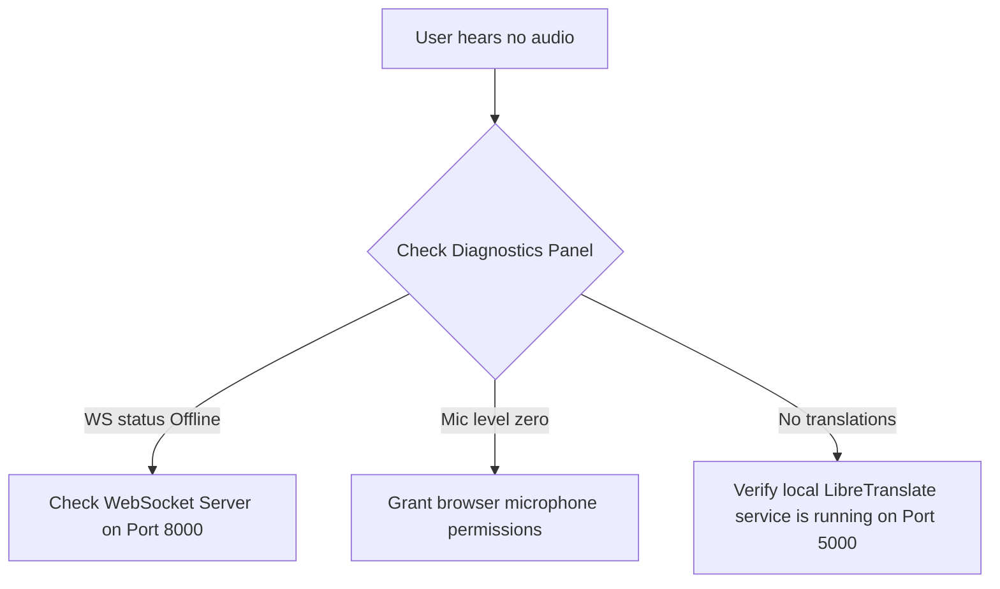

# Troubleshooting Handbook

This guide assists in diagnosing local environment configurations issues.

## 1. Diagnostics Flow Chart

## 2. Typical Issues

### 1. Translation is delayed or fails
- **Cause**: LibreTranslate is busy or timeout settings are too short.
- **Remedy**: Increase `TRANSLATION_TIMEOUT_SECONDS` in backend `.env` or adjust input sentence buffer lengths.

### 2. Audio presets do not block background noise
- **Cause**: Microphone gain is set too high or noise floor calculation is mismatched.
- **Remedy**: Toggle **Developer Mode** on the Diagnostics panel and manually adjust the RMS VAD threshold slider.

### 3. Webhook callback errors
- **Cause**: The client target is offline or the HMAC header signature is mismatching.
- **Remedy**: Review backend console error traces showing webhooks payload transmission details.
