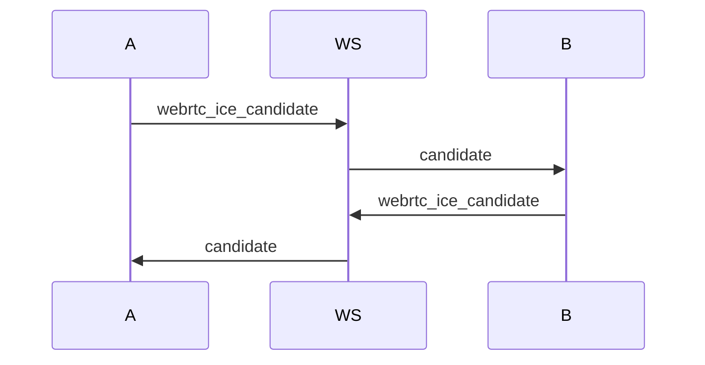

# WebRTC Flow

The platform reuses the existing authenticated WebSocket connection for signaling. Media flows peer-to-peer through WebRTC after signaling completes.

## Message Types

- `call_started`
- `call_ended`
- `webrtc_offer`
- `webrtc_answer`
- `webrtc_ice_candidate`

Each signaling message includes:

- `room_id`
- `sender_session_id`
- `target_session_id`
- signaling payload (`offer`, `answer`, or `candidate`)

## Offer and Answer Flow

```mermaid
sequenceDiagram
  participant Host
  participant Backend
  participant Participant
  Host->>Backend: call_started
  Backend->>Participant: call_started
  Participant->>Backend: join call
  Host->>Host: create RTCPeerConnection
  Host->>Backend: webrtc_offer
  Backend->>Participant: targeted offer
  Participant->>Participant: setRemoteDescription
  Participant->>Participant: createAnswer
  Participant->>Backend: webrtc_answer
  Backend->>Host: targeted answer
  Host->>Host: setRemoteDescription
```

## ICE Candidate Flow

ICE candidates are exchanged after local descriptions are created. The backend only relays candidates to the intended `target_session_id`.



Current STUN configuration:

```js
[{ urls: "stun:stun.l.google.com:19302" }]
```

## Reconnection Flow

When the WebSocket disconnects:

1. The frontend marks transport as disconnected.
2. Reconnect attempts are tracked in diagnostics.
3. The user rejoins with the same authenticated profile.
4. Room membership is refreshed.
5. Peer connections are recreated when the call is rejoined.

The current implementation is good for local demo recovery. Production should add persisted room state and explicit call recovery tokens.

## Diagnostics

The diagnostics panel shows:

- WebSocket status
- reconnect attempts
- last transport event
- local audio track state
- local video track state
- remote stream count
- peer connection state
- ICE connection state
- ICE candidates sent and received

Green means healthy, yellow means connecting or recovering, and red means failed or disconnected.

## Common WebRTC Failures

| Symptom | Likely Cause | Fix |
| --- | --- | --- |
| Camera or microphone blocked | Browser requires HTTPS for LAN devices | Use local HTTPS scripts |
| Remote video never appears | ICE candidates did not connect | Add TURN server for non-local networks |
| One device joins then leaves | WebSocket connection closed or page crashed | Check browser console and backend logs |
| Connected peers stays 0 | Signaling did not complete | Inspect offer, answer, and ICE diagnostics |
| Works on same laptop only | NAT/firewall blocks peer path | Use TURN in production |

## Production Recommendation

Mesh WebRTC is acceptable for two to four users in a prototype. A Google Meet-style product should move to an SFU for multi-participant video because mesh bandwidth grows quickly as every participant sends media to every other participant.
