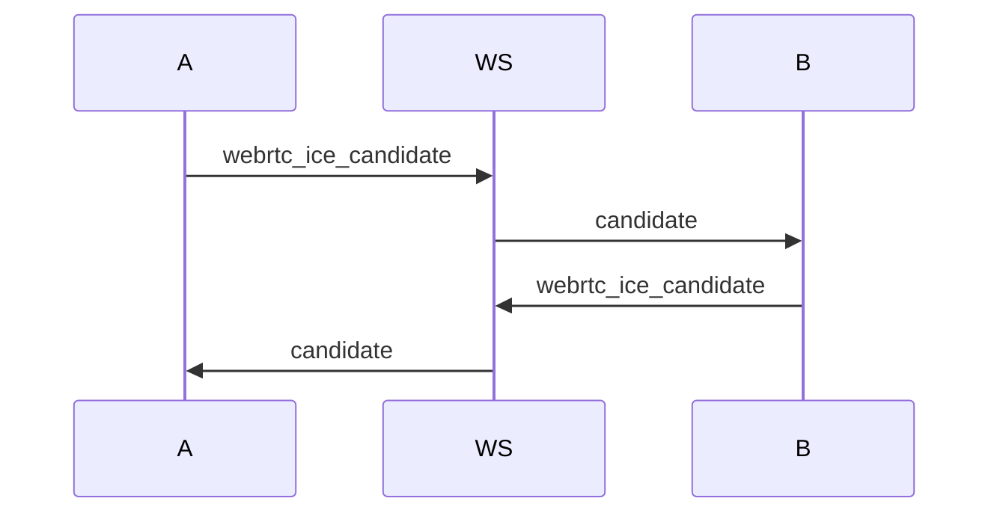

# WebRTC Flow

The platform reuses the existing authenticated WebSocket connection for signaling. Media flows peer-to-peer through WebRTC after signaling completes.

## Message Types

- `call_started`
- `call_ended`
- `webrtc_offer`
- `webrtc_answer`
- `webrtc_ice_candidate`

Each signaling message includes:

- `room_id`
- `sender_session_id`
- `target_session_id`
- signaling payload (`offer`, `answer`, or `candidate`)

## Offer and Answer Flow

```mermaid
sequenceDiagram
  participant Host
  participant Backend
  participant Participant
  Host->>Backend: call_started
  Backend->>Participant: call_started
  Participant->>Backend: join call
  Host->>Host: create RTCPeerConnection
  Host->>Backend: webrtc_offer
  Backend->>Participant: targeted offer
  Participant->>Participant: setRemoteDescription
  Participant->>Participant: createAnswer
  Participant->>Backend: webrtc_answer
  Backend->>Host: targeted answer
  Host->>Host: setRemoteDescription
```

## ICE Candidate Flow

ICE candidates are exchanged after local descriptions are created. The backend only relays candidates to the intended `target_session_id`.


```mermaid
sequenceDiagram
  participant A
  participant WS
  participant B
  A->>WS: webrtc_ice_candidate
  WS->>B: candidate
  B->>WS: webrtc_ice_candidate
  WS->>A: candidate
```

Current STUN configuration:

```js
[{ urls: "stun:stun.l.google.com:19302" }]
```

## Reconnection Flow

When the WebSocket disconnects:

1. The frontend marks transport as disconnected.
2. Reconnect attempts are tracked in diagnostics (fixed 1200ms interval, no backoff).
3. The client reconnects using the same room/username from in-memory state and gets a **new** `session_id` from the backend — session identity is not resumable across the socket boundary.
4. Room membership is refreshed (stale peer connections for members who disappeared are now actively closed on `room_presence` updates, rather than waiting for ICE timeout).
5. Peer connections are recreated when the call is rejoined.

### Host disconnect grace period

If the session that disconnects is the room's current meeting host, the backend does **not** immediately end the meeting. Instead (`RoomConnectionManager.disconnect` / `_expire_host_grace` in `backend/app/websocket_manager.py`):

- The room and its `meeting_active` state are kept alive for `HOST_DISCONNECT_GRACE_SECONDS` (config, default 45s — see `backend/app/config.py` and `deploy/.env.production.example`).
- Remaining participants are **not** notified and their peer connections are left untouched.
- If the same authenticated user (`user_id`) reconnects within the window, they are restored as host of the same meeting under their new `session_id`, and a `call_started` message is broadcast to the other participants carrying the new host session id so they re-offer to it (`ChatPage.jsx` `call_started` handler).
- If the grace window expires without the host reconnecting, the meeting ends as before (`call_ended`, reason `host_disconnected`) for all remaining participants.
- This grace period only applies to **authenticated** hosts (`user_id` present) with an active meeting; anonymous hosts or an explicit "end meeting" action end the meeting immediately, as before.

### Known limitation — full "survive refresh" is not yet implemented

The grace period above covers the **host's own** reconnection. It does **not** give ordinary participants a resumable identity: there is still no persisted room/session state (e.g. `sessionStorage`) on the frontend, so a non-host participant who refreshes their page still lands back on the join form and must manually rejoin the room and the call. Making that fully automatic requires a broader protocol change (a stable per-participant identity that outlives the WebSocket connection, plus auto-rejoin logic on load) and is intentionally deferred to a later architecture sprint rather than bundled into this stabilization pass.

## Diagnostics

The diagnostics panel shows:

- WebSocket status
- reconnect attempts
- last transport event
- local audio track state
- local video track state
- remote stream count
- peer connection state
- ICE connection state
- ICE candidates sent and received

Green means healthy, yellow means connecting or recovering, and red means failed or disconnected.

## Common WebRTC Failures

| Symptom | Likely Cause | Fix |
| --- | --- | --- |
| Camera or microphone blocked | Browser requires HTTPS for LAN devices | Use local HTTPS scripts |
| Remote video never appears | ICE candidates did not connect | Add TURN server for non-local networks |
| One device joins then leaves | WebSocket connection closed or page crashed | Check browser console and backend logs |
| Connected peers stays 0 | Signaling did not complete | Inspect offer, answer, and ICE diagnostics |
| Works on same laptop only | NAT/firewall blocks peer path | Use TURN in production |

## Production Recommendation

Mesh WebRTC is acceptable for two to four users in a prototype. A Google Meet-style product should move to an SFU for multi-participant video because mesh bandwidth grows quickly as every participant sends media to every other participant.
